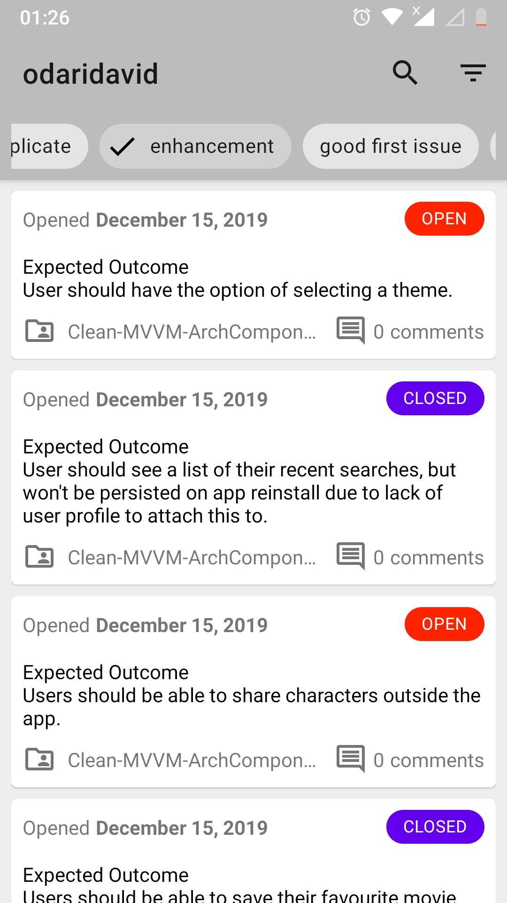
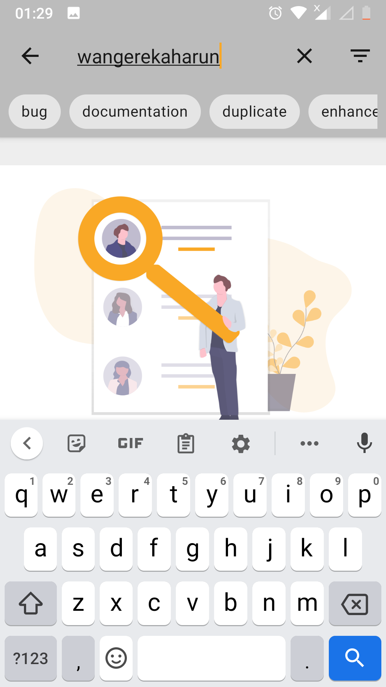
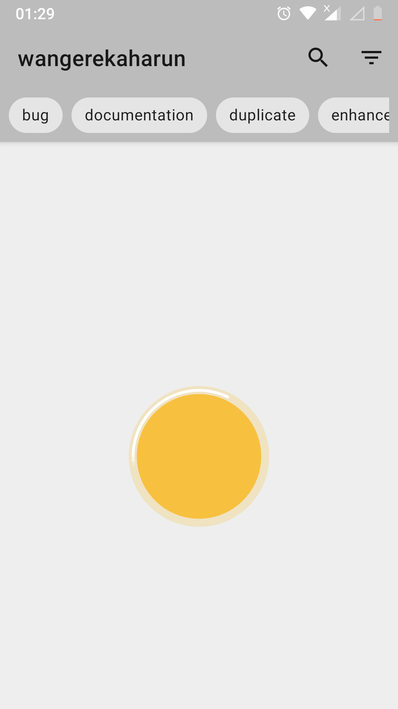

<h1 align="center">GithubIssueTracker</h1>

   

# Screenshots
|||||
|:--:|:--:|:--:|:--:|
|||||
|:--:|:--:|:--:|:--:|

## Tech-stack

* Tech-stack
    * [Kotlin](https://kotlinlang.org/) - a cross-platform, statically typed, general-purpose programming language with type inference.
    * [Coroutines](https://kotlinlang.org/docs/reference/coroutines-overview.html) - perform background operations.
    * [Flow](https://kotlinlang.org/docs/reference/coroutines/flow.html) - handle the stream of data asynchronously that executes sequentially.
    * [HILT](https://dagger.dev/hilt/) - Hilt provides a standard way to incorporate Dagger dependency injection into an Android application.
    * [Apollo GraphQL Client](https://www.apollographql.com/docs/android/essentials/get-started) - Apollo is a platform for building a data graph.
    * [Jetpack](https://developer.android.com/jetpack)
        * [LiveData](https://developer.android.com/topic/libraries/architecture/livedata) - is an observable data holder.
        * [Lifecycle](https://developer.android.com/topic/libraries/architecture/lifecycle) - perform action when lifecycle state changes.
        * [ViewModel](https://developer.android.com/topic/libraries/architecture/viewmodel) - store and manage UI-related data in a lifecycle conscious way.

* Architecture
    * MVVM - Model View View Model
* Tests
    * [Unit Tests](https://en.wikipedia.org/wiki/Unit_testing) ([JUnit](https://junit.org/junit4/)) - a simple framework to write repeatable tests.
    * [Mockito](https://github.com/mockito/mockito)
    * [Truth](https://truth.dev/) - Fluent assertions for Java and Android
    * [Espresso](https://developer.android.com/training/testing/espresso) - write concise, beautiful, and reliable Android UI tests.

* CI/CD
    * Github Actions